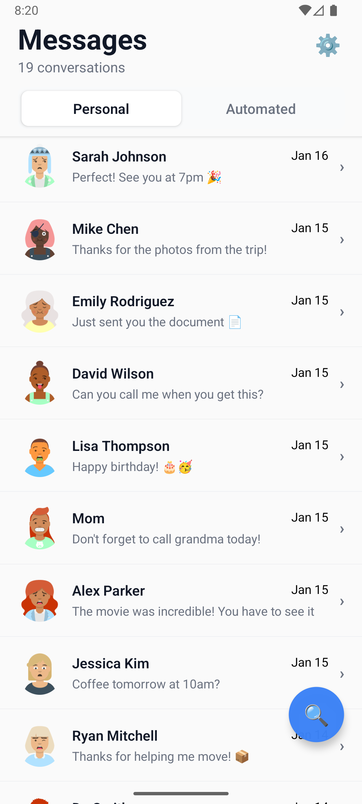
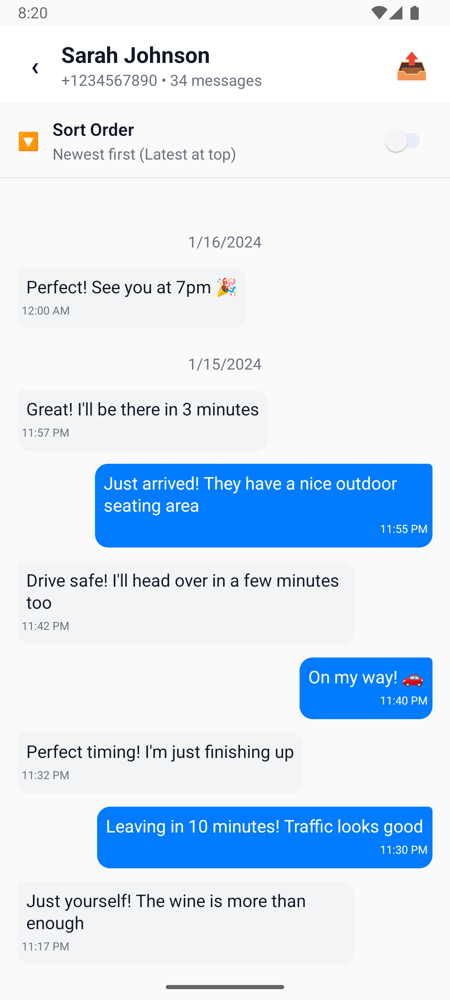
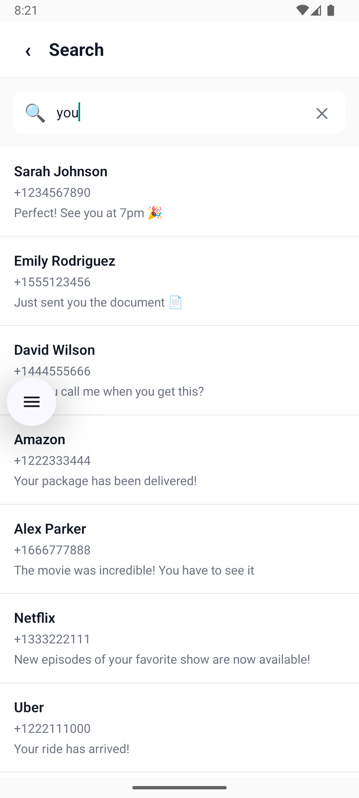
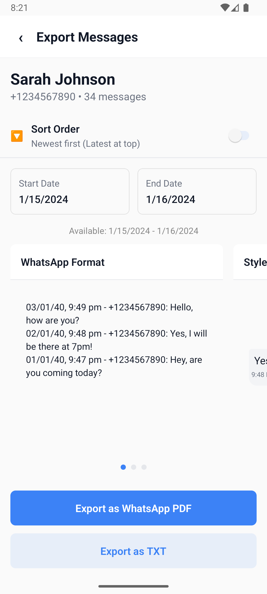
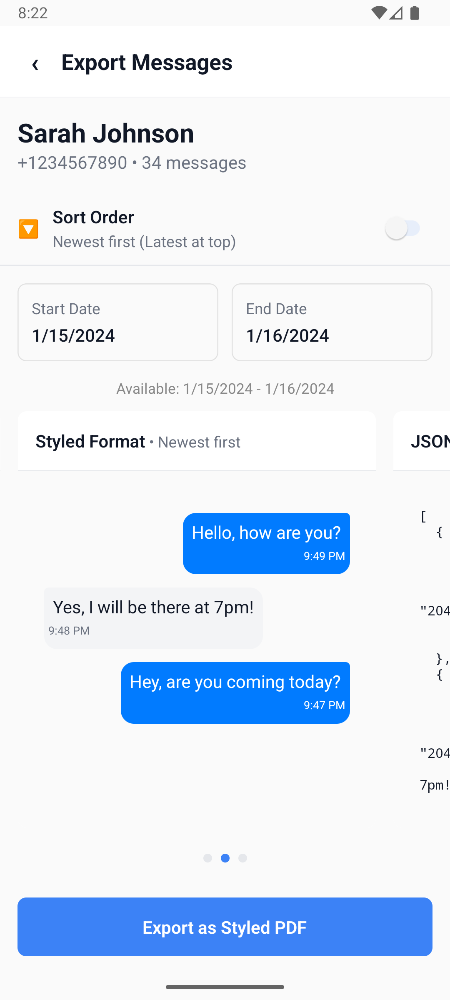
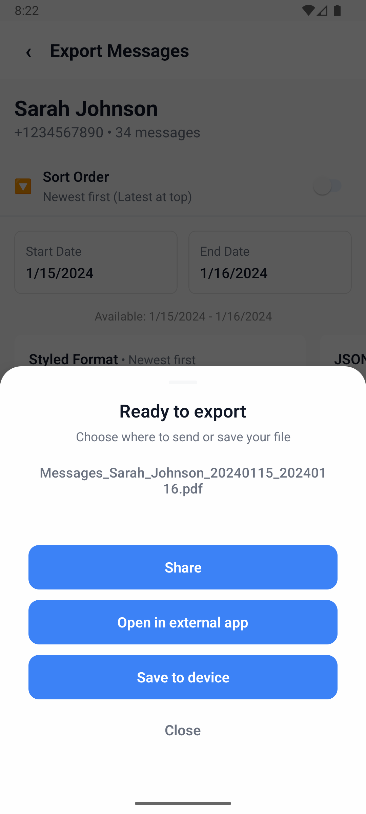
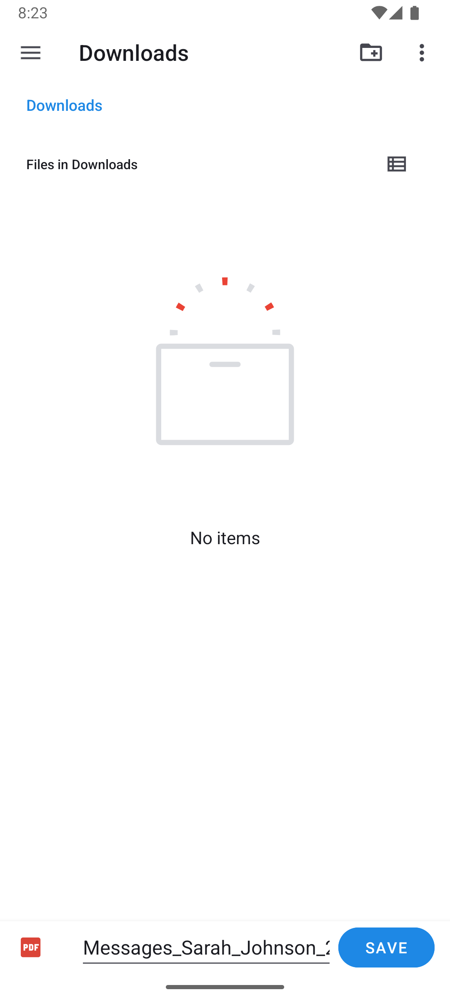

# About MessageSave: Easy SMS Export

MessageSave: Easy SMS Export allows you to easily view, search, and export your SMS/MMS messages. It provides a fast and user-friendly interface to manage your conversations and back them up for future use.

## Download

Download the latest APK from [here](https://raw.githubusercontent.com/paskdn/messagesave/main/assets/MessageSave.apk)

## Features

### View Conversations and Messages

* **Conversation List:** View a list of all your conversations, with the sender's name and the last message.
* **Message View:** See all the messages in a conversation, including the message body, date, and media attachments.
* **Media Viewer:** View images, videos, and audio attachments directly in the app.

### Search

* **Search Conversations:** Quickly find a conversation by searching for the sender's name.
* **Search Messages:** Search for specific messages within a conversation.

### Export

* **Export Conversations:** Export one or more conversations to a file.
* **Multiple File Formats:** Choose to export your messages as a JSON or TXT file.
* **Date Range Filter:** Filter messages by date to export only the messages you need.
* **Background Export:** The export process runs in the background, so you can continue using the app while the export is in progress.
* **Export Progress:** An export modal shows the real-time progress of the export.
* **Share and Save:** Once the export is complete, you can share the file or save it to your device.

### User Interface

* **Light and Dark Modes:** The app supports both light and dark modes for a comfortable viewing experience.
* **Customizable Theme:** The app uses a customizable theme to ensure a consistent look and feel.
* **Intuitive Navigation:** The app is designed to be easy to use, with a simple and intuitive navigation system.

## Screenshots

Here are some screenshots of MessageSave in action:

| Conversations | Messages |
| --- | --- |
|  |  |
|  |  |
|  |  |
|  |  |

## Privacy Policy

You can view our Privacy Policy [here](https://sites.google.com/view/messagesaveeasysmsexport/home).
